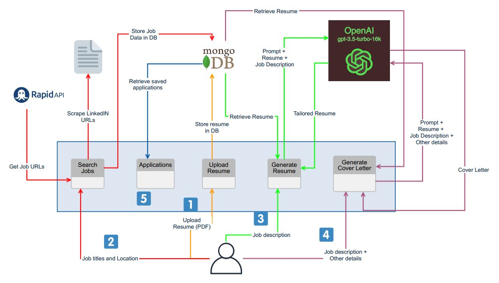

# Job Preparation Application


This Job Preparation Application is designed to streamline the job search and application process. It offers six distinct sections to help users manage their job search effectively.





## Features


https://github.com/dishadas168/Job-Prep/assets/44092220/e93208a9-67cb-47d3-8444-8971478db757


### 1. Upload Resume
In the "Upload Resume" section, users can upload their resume in PDF format. The application stores the document in a MongoDB database for easy access and retrieval.

### 2. Search Jobs
The "Search Jobs" section allows users to specify desired job roles and locations. The application utilizes a LinkedIn API to extract job descriptions, URLs, job details, and salary information. The results are displayed in a table format, and users can mark their application status with checkboxes, which are also saved to the database.

### 3. Generate Resume
The "Generate Resume" section lets users customize their resume according to the job description. Users simply paste the job description, click submit, and receive a tailored resume in DOCX format. This document can be downloaded and edited as needed.

### 4. Generate Cover Letter
In the "Generate Cover Letter" section, users can create a customized cover letter based on the job description. The application generates a cover letter in DOCX format, which users can download and further customize.

### 5. Applications
In the "Applications" section, users can view the jobs they've applied for. This provides a convenient overview of their job application history.


## Technologies Used

- **UI:** Streamlit
- **Database:** MongoDB Atlas
- **LinkedIn API:** RapidAPI
- **Text Generation:** OpenAI, Langchain

## Getting Started

1. **RapidAPI Key**: Before starting the application, ensure you have obtained a RapidAPI key and add it to the `.env.example` file.
2. **OpenAI API Key**: You will also need OpenAI API Key to use the GPT models. Add the key to `.env.example` file.
3. **MongoDB URI**: This application currently supports a MongoDB Database for backend storage. Add the URI to `.env.example` file.
4. Execute the following code to get started.
```shell
cp .env.example .env
docker build -t job-prep .
docker run -d --env-file .env -p 8501:8501 job-prep
```

## Roadmap

- Implement user authentication
- Save job data for each search ID to reduce redundant API calls
- Add dropdown for Search IDs on the Search Jobs Page
- Add Dashboard page for job market insights for current Search ID


## License

This project is licensed under the MIT License
